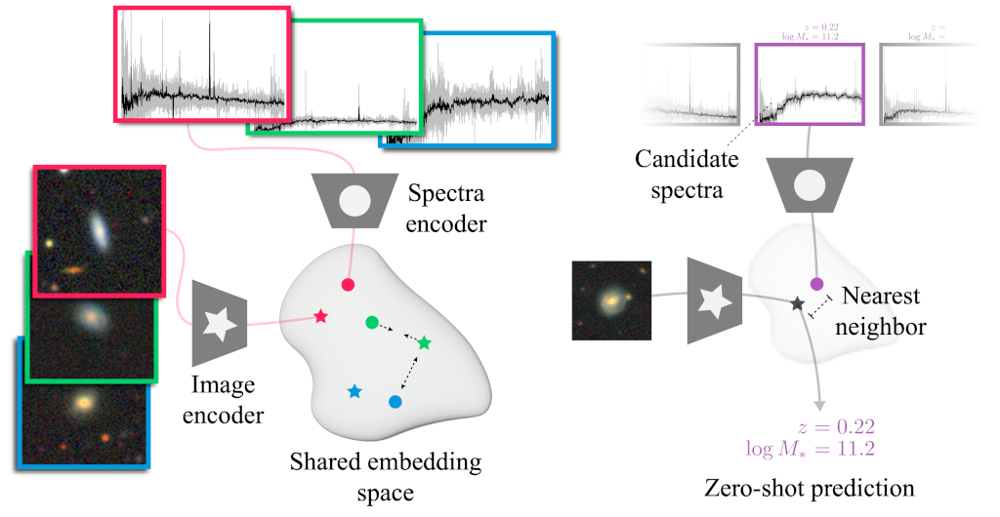

# AstroCLIP



## Install
Note that an up-to-date eventlet is required for wandb.
The following packages are excluded from the project's dependencies to allow for a more flexible system configuration (i.e. allow the use of module subsystem).

```bash
pip install --upgrade pip
pip install --upgrade eventlet torch lightning[extra]
pip install -e .
```

### Spectrum encoder:

Run with
```
spectrum_trainer -c astroclip/specformer/config.yaml
```

## Training Single-Modal SSL Models

### AstroDINO
The AstroDINO model is based on the DINO_v2 model and can be run from the astrodino subdirectory.

Once in the subdirectory, run with
```
srun python -m astrodino.train.train --config-file={CONFIG} --output-dir={OUTPUT DIR} --run-name={RUN NAME}
```
